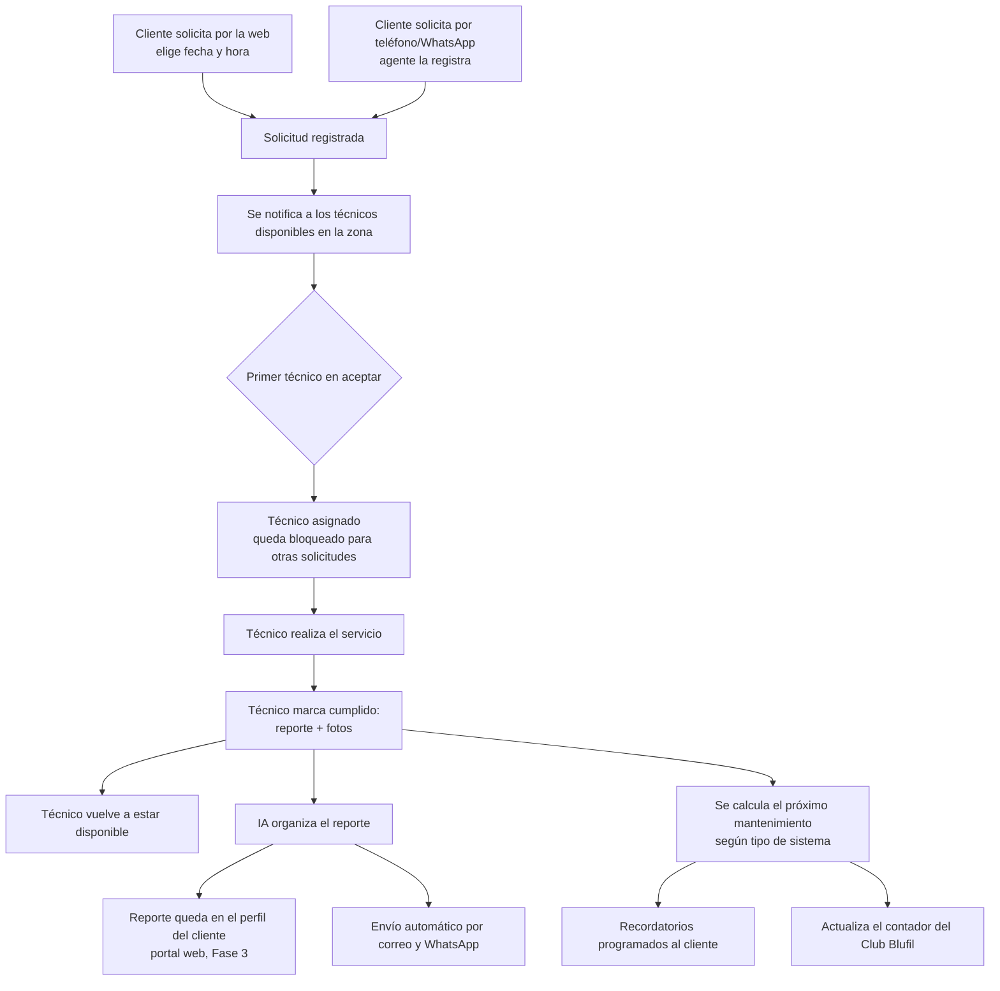

# Blufil — Plan de desarrollo

Borrador de organización. Se arma con todo lo acordado hasta ahora en `docs/PROYECTO.md` para dejar clara la secuencia antes de empezar a construir. Pendiente de que el usuario agregue instrucciones adicionales antes de cerrarlo como definitivo.

**Última actualización:** 2026-09-02

**Estado de avance (2026-09-02):**
- ✅ Fase 2 (esquema de datos): proyecto Supabase "Blufil" creado (`zxlctemyciwshfsqvhgw`), 9 tablas + RLS + función `aceptar_servicio` para asignación atómica de técnicos, verificado con datos de prueba (aislamiento correcto entre clientes, sin fugas de datos).
- ✅ Fase 3 (portal de cliente, MVP): app Next.js en [`portal/`](../portal/), **en vivo en https://portal.blufil.com** (Hostinger, subdominio Node.js). Login **por cédula + contraseña**: contraseña inicial = número de cédula, cuenta bloqueada hasta confirmar el correo (Supabase Auth), y el cliente puede cambiar su contraseña desde el portal (`/dashboard/cambiar-clave`). Historial de servicios incluye fotos (miniaturas con URL firmada). Edge Functions: `iniciar-sesion` y `provisionar-cliente`. Correo transaccional saliendo por SMTP propio (`notificaciones@blufil.com`) con plantilla de "Confirm signup" brandeada. Verificado de punta a punta en producción.
- ✅ Panel de técnicos (`/tecnico/login`, `/tecnico/dashboard`, `/tecnico/servicio/[id]`, `/tecnico/cambiar-clave`): mismo patrón de login por cédula + contraseña (tabla `tecnicos` ahora tiene `correo`/`cedula`). El técnico ve las solicitudes pendientes sin asignar, las acepta (usa `aceptar_servicio`, asignación atómica), y al completar sube notas + fotos + valor cobrado + descuento + próximo mantenimiento — las fotos van a un bucket privado de Storage (`servicios-fotos`) con RLS por servicio. Edge Functions: `iniciar-sesion-tecnico`, `provisionar-tecnico`. Verificado de punta a punta (aceptar → completar → foto subida y visible en el portal del cliente), datos de prueba eliminados.
- ✅ Recuperar contraseña (self-service, clientes y técnicos): `/recuperar` pide la cédula, `recuperar-clave` (Edge Function) la resuelve contra `clientes` o `tecnicos` y dispara el correo de reset de Supabase (branded); `/auth/recuperar` procesa el enlace y manda a `/restablecer-clave` para elegir la nueva contraseña. Respuesta siempre genérica (no revela si la cédula existe). Enlace "¿Olvidaste tu contraseña?" agregado en ambos logins.
- Falta: una vía real de alta de clientes/técnicos (hoy `provisionar-cliente`/`provisionar-tecnico` se invocan a mano; se conectarán a la migración de Odoo o a un panel admin más adelante).

### Fase 4 (parcial) — Integración Siigo Nube (2026-09-02) ✅

Facturación electrónica conectada de punta a punta:
- Credenciales (`siigo_username`, `siigo_access_key`) guardadas cifradas en **Supabase Vault** (no en variables de entorno ni en el repo). Solo accesibles desde Edge Functions vía la función `obtener_secreto()` (restringida a `service_role`).
- **Edge Function `facturar-visita`**: al recibir un `visita_id`, verifica que todos los servicios de esa visita estén `completada`, busca o crea el cliente como tercero en Siigo, arma los ítems de factura con la descripción real del servicio (tipo de sistema + notas del técnico) y consolida en una sola factura electrónica.
- **Clientes residenciales y empresariales (2026-09-02):** columna `clientes.tipo_persona` (`natural`/`juridica`, default `natural`). El tercero en Siigo se arma distinto según el tipo: `natural` → `person_type: "Person"`, `id_type: "13"` (cédula), nombre partido en dos campos, `fiscal_responsibilities: R-99-PN`. `juridica` → `person_type: "Company"`, `id_type: "31"` (NIT), razón social (`clientes.nombre`) en un solo campo, sin dígito de verificación — Siigo lo calcula automáticamente. El resto del flujo (búsqueda por identificación, ítems, factura, ciudad) es idéntico para ambos.
- **Disparador automático**: al marcar el último servicio pendiente de una visita como completado (`portal/src/app/tecnico/(app)/servicio/[id]/actions.ts`), el portal llama a `facturar-visita` automáticamente — sin intervención manual.
- **Configuración de la cuenta Siigo de Blufil (descubierta y confirmada con el usuario):**
  - Tipo de documento: **Factura electrónica de venta FJ** (id `31126`)
  - Vendedor: único usuario de la cuenta (id `22`)
  - IVA: **0%** — servicios sin IVA (id `13681`)
  - Forma de pago por defecto: **Transferencia** (id `7001`)
  - Productos genéricos creados en Siigo para no ensuciar su catálogo existente (256 productos ad-hoc): `PORTAL-INSTALACION` y `PORTAL-MANTENIMIENTO` — la descripción real de cada factura se escribe por ítem, no depende del nombre del producto.
- **Verificado con una factura real de prueba** ($1.000 COP, FV-3-316) — cliente creado correctamente, ítem con descripción completa, IVA 0%, Transferencia. Quedó en estado "Draft" (sin timbrar) — el usuario decide si la anula desde Siigo.
- **Persona jurídica/NIT verificado con una factura real de prueba** ($1.000 COP, cliente "Distribuidora de Pruebas SAS", NIT 900123456) — Siigo creó el tercero como `person_type: "Company"`, `id_type: NIT (31)`, calculó el dígito de verificación solo (`8`), y por defecto asignó `fiscal_responsibilities: R-99-PN` aunque no se envió explícito. Datos de prueba eliminados de Supabase; la factura quedó en Siigo (Draft).
- **Limitación conocida:** la ciudad del tercero se resuelve por un mapeo fijo (Barranquilla/Soledad/Puerto Colombia); si no coincide, usa Barranquilla por defecto.
- Falta: envío de la factura por correo al cliente (Siigo lo soporta, no está conectado todavía), y manejo de reintentos si Siigo falla (hoy el disparador falla en silencio para no bloquear el cierre del servicio en el portal).
- ⏳ Migración de Odoo: pospuesta a propósito hasta que el esquema/portal estén más maduros (ver sección de CRM abajo).
- ⏳ Pendiente: integración Siigo Nube (Fase de facturación) y Hermes Agent (reportes de servicio).

---

## Fase 0 — Fundamentos (completado)

- Plan de negocios (residencial + industrial/B2B)
- Estudio de mercado (5 fuentes + WhatsApp propio) → [Artifact publicado](https://claude.ai/code/artifact/c7184542-f75b-4fca-9810-be1cb25370ea)
- Identidad de marca (logo aplicado)
- Landing "en construcción" en producción (blufil.com, Hostinger)
- 4 programas de fidelización/crecimiento diseñados (Club Blufil, Referidos, Retoma, Trabaja con Nosotros)
- Requisito de portal de cliente identificado

## Fase 1 — Sitio público (MVP informativo)

Reemplaza la landing "en construcción" por el sitio real. Sigue la fase "MVP informativo primero" ya decidida en la conversación de alcance inicial.

- Home con propuesta de valor y los 3 pilares del plan de negocios (tecnología, asesoría, servicio)
- Catálogo residencial: Doble Filtración, Ultrafiltración, Ósmosis Inversa, Dispensador sin botellón — con precios reales (sección 3 de PROYECTO.md), no placeholder
- Comparativa de los 3 sistemas (ya identificada como pendiente en la lista de mejoras — reduce la reexplicación repetida que vimos en WhatsApp)
- Página "Nosotros" — sin mencionar "Filtros Americanos" directamente, pero con narrativa de trayectoria/experiencia que capitalice los años de operación real
- Página de contacto con CTA directo a WhatsApp (canal ya validado como el real)
- Landing separada para industrial/B2B (formulario de cotización, no catálogo con precio — ese mercado se cotiza a la medida)
- SEO básico (title/meta por página, sitemap)

**Depende de:** ninguna otra fase. Puede arrancar ya.
**Falta del usuario:** copy final aprobado, fotos de instalaciones reales (si hay disponibles), confirmación de qué tan explícito ser sobre "Filtros Americanos" en la narrativa de marca.

## Fase 2 — Infraestructura de datos

Backend antes de construir cualquier cosa que dependa de login o historial (portal de cliente, programas).

- Elegir motor: Supabase (Postgres + Auth + Storage) es la opción natural — ya hay tooling conectado a esta sesión y encaja con el hosting Node.js existente en Hostinger.
- Modelo de datos mínimo:
  - `clientes` (contacto, dirección, fuente de adquisición)
  - `sistemas_instalados` (tipo, fecha instalación, cliente)
  - `servicios` (mantenimiento/instalación, fecha, técnico, fotos, valor cobrado, descuento aplicado)
  - `tecnicos` (perfil, ciudad, estado de certificación)
  - `referidos` (referente, referido, estado, crédito liberado)
  - `retomas` (cliente, equipo entregado, marca, bono aplicado)
  - `club_blufil` (cliente, conteo de mantenimientos, nivel actual, vigencia de racha)

**Depende de:** Fase 1 puede ir en paralelo, no bloquea.
**Falta del usuario:** confirmar si Supabase es aceptable o si hay preferencia distinta de proveedor/base de datos.

## Fase 3 — Portal de cliente

- Autenticación de clientes (login simple — teléfono o correo, dado que hoy todo el registro de clientes ya ocurre por WhatsApp)
- Historial de servicios por cliente: fecha, tipo, técnico, fotos subidas por el técnico
- Estado visible del Club Blufil: mantenimiento # actual, nivel de descuento vigente, próximo mantenimiento recomendado
- Este portal es la implementación directa del requisito registrado en PROYECTO.md sección 8.1

**Depende de:** Fase 2 (datos) y define en Fase 1 el sitio donde vive.
**Falta del usuario:** ninguno bloqueante — se puede detallar en su momento.

## Fase 4 — Programas activos

Automatizar lo que hoy en el chat de WhatsApp se lleva de forma manual.

- **Club Blufil:** cálculo automático del nivel de descuento según la escala (sección 6.1 de PROYECTO.md) y la ventana de vigencia de la racha
- **Referidos:** generación de código/link por cliente, tracking de conversión, liberación de crédito solo tras instalación + pago confirmados
- **Retoma:** registro del equipo recibido y aplicación del bono en la venta
- **Trabaja con Nosotros:** formulario de postulación de técnicos + panel simple para revisar/aprobar postulantes

**Depende de:** Fase 2 y 3.
**Falta del usuario:** aprobación final de montos (ya marcado como pendiente en PROYECTO.md sección 9).

## Fase 5 — Catálogo ampliado (industrial/B2B)

- Página de filtración industrial a la medida (formulario de cotización por caudal/aplicación, no precio de lista)
- Página de planta desalinizadora (ficha técnica + formulario de cotización)
- Ambas alimentan al mismo flujo de WhatsApp/CRM que ya opera para residencial

**Depende de:** Fase 1 (mismo sitio) y decisión pendiente sobre proveedor de desalinización (PROYECTO.md sección 9).

## Fase 6 — E-commerce

Segunda fase del negocio según la decisión de alcance original ("MVP informativo primero, e-commerce después").

- Carrito y checkout para el catálogo residencial
- Pasarela de pagos (a definir cuál — Colombia: PayU, Wompi, MercadoPago, etc.)
- Aplicación automática de descuentos de Club Blufil/referidos/retoma en el checkout

**Depende de:** Fase 1 y Fase 4 (para que los descuentos de los programas se puedan aplicar automáticamente).

## Fase 7 — Expansión nacional

- Activar la red de técnicos certificados (Fase 4) en ciudades objetivo identificadas en el estudio de mercado
- Flujo de envío por transportadora + instalación por técnico certificado local (reemplaza el autoinstalado informal actual)

**Depende de:** Fase 4 con la red de técnicos ya operando con al menos algunos certificados.

---

## Decisiones confirmadas (2026-09-01)

1. **Backend/BD: Supabase** (Postgres + Auth + Storage + Realtime). El Realtime es clave para el sistema de agendamiento de la sección siguiente — el panel de técnicos necesita actualizarse al instante.
2. **Efectos visuales del sitio:** scroll-reveal (fade/slide al aparecer cada sección) + 1-2 "wave dividers" animados (SVG, con parallax sutil) entre secciones. Simulación de fluido en WebGL queda como posible detalle puntual del hero más adelante, no como base del sitio (pesa mucho en móvil).
3. **Orden confirmado:** Fase 1 (sitio web) antes de Fase 6 (e-commerce), sin cambios sobre lo ya planteado.
4. **Nuevo requisito funcional:** sistema de agendamiento y cumplimiento de servicios (ver sección completa abajo).

## Base de clientes (CRM) y facturación electrónica

Registrado 2026-09-01.

### CRM: desarrollo propio, no herramienta externa

Blufil no necesita un CRM externo (HubSpot, Pipedrive, etc.) — las tablas `clientes`, `servicios` y `visitas` que ya están planeadas en la Fase 2 y en el sistema de agendamiento (sección siguiente) **son** el CRM, hecho a la medida de los flujos reales de Blufil (Club Blufil, bloqueo de técnicos, reportes de servicio) en vez de adaptar una herramienta genérica encima.

`clientes.estatus` controla los recordatorios automáticos:

| Estatus | Cuándo aplica |
|---|---|
| Nuevo | Instalación reciente, sin mantenimiento aún |
| Activo | Al día con su ciclo de mantenimiento |
| Por vencer | Se acerca la fecha recomendada → dispara recordatorio |
| Vencido | Pasó la fecha sin agendar |
| Inactivo | Mucho tiempo sin contacto/servicio |

Una tarea programada (diaria, en Supabase) revisa la fecha de próximo mantenimiento de cada cliente, actualiza el estatus, y dispara el recordatorio por WhatsApp/correo — automatiza lo que hoy se hace manualmente (confirmado en las conversaciones reales de WhatsApp revisadas en el estudio de mercado). Los clientes nuevos se crean automáticamente al cerrarse una instalación, sin doble ingreso manual.

**Confirmado (2026-09-02):** la base de clientes actual vive en **Odoo**, con los servicios programados también ahí. La migración se hará por acceso directo a la API de Odoo (XML-RPC/JSON-RPC) cuando el usuario comparta las credenciales — decidido posponerla hasta que el resto del sistema (esquema + portal) esté más avanzado, para no migrar datos hacia una base que todavía está cambiando de forma. Odoo queda como fuente de solo lectura hasta ese momento; Supabase es ya la única base operativa nueva.

### Integración con Siigo Nube (facturación electrónica)

Confirmado con la documentación oficial ([developers.siigo.com/docs/siigoapi](https://developers.siigo.com/docs/siigoapi/)): Siigo tiene API pública con endpoints `/customers` (crear/consultar/actualizar terceros) y `/invoices` (crear, editar, enviar por correo, anular y consultar facturas de venta electrónicas).

**Arquitectura:** al cerrar un servicio/venta en Supabase → llamada a Siigo API → (1) crea el cliente como tercero si no existe, (2) genera la factura electrónica válida ante la DIAN. Siigo queda como fuente de verdad **fiscal/legal**; Supabase como fuente de verdad **operativa** (agendamiento, Club Blufil, historial). Se enlazan por cédula/NIT o correo, sin duplicar datos. La factura puede ir en el mismo envío que el reporte de servicio de Hermes (sección anterior).

**Credenciales:** ya se cuenta con la API key de Siigo — no queda pendiente por solicitar. Al momento de implementar, va como variable de entorno/secreto en Supabase (Edge Function secrets), nunca en texto plano en el repositorio ni en este documento.

No hay conector MCP para Siigo (no aparece en el registro de conectores ni en las herramientas disponibles) — se integra por **API directa** desde una función del backend en Supabase.

### Clientes con más de un sistema instalado

Un mismo cliente puede tener 2+ filtros, en la misma dirección o en direcciones distintas. El modelo de datos ya lo soporta:

- `sistemas_instalados` lleva su **propia dirección** (no se hereda del cliente).
- Cada `servicios` corresponde a un **sistema instalado específico** — el historial y el reporte quedan separados por sistema.
- **Confirmado:** el Club Blufil se cuenta **por sistema instalado**, no combinado a nivel de cliente — cada filtro lleva su propio conteo de mantenimientos y su propio nivel de descuento.

### Consolidación de facturas por visita

El cliente puede pedir servicio para varios de sus filtros a la vez — eso no debería obligarlo a pagar una factura por cada equipo. Se separan dos capas:

- **`servicios`** — sigue siendo 1 por sistema instalado (reporte, fotos, conteo de Club Blufil independiente por filtro).
- **`visitas`** (nueva tabla) — la solicitud/agenda: cliente, fecha, uno o varios sistemas a atender, uno o varios técnicos asignados (un sistema puede requerir un técnico distinto al de otro sistema dentro de la misma visita — la tabla lo soporta vía relación con `servicios`, no asume un único técnico por visita).
- **`facturas`** — se genera al facturar, no al agendar. Toma los `servicios` de una `visita` y los consolida en una sola factura con una línea por equipo — eso es lo que se envía a Siigo como un único comprobante.

**Confirmado:** la consolidación es **por visita** — si varios sistemas se atienden en la misma visita, se facturan juntos por defecto, así se hayan usado técnicos distintos para cada sistema dentro de esa visita.

## Sistema de agendamiento y cumplimiento de servicios

Registrado 2026-09-01. Formaliza y automatiza lo que hoy Blufil hace manualmente por WhatsApp (asignar técnico, confirmar cita, cerrar servicio, recordar el próximo mantenimiento). Se conecta directamente con Fase 3 (portal de cliente) y Fase 4 (programas activos) — es, en la práctica, el motor operativo de ambas.

### Flujo

### Paso a paso

1. **Solicitud** — por la web (cliente elige fecha/hora deseada) o por teléfono/WhatsApp (un agente la registra manualmente en el mismo sistema). Ambos canales alimentan la misma tabla de solicitudes, así el flujo es idéntico de ahí en adelante sin importar el origen.
2. **Notificación y asignación por "primero que acepta"** — el sistema avisa a los técnicos disponibles en la zona. El primero en aceptar queda asignado; los demás dejan de ver esa solicitud. Técnicamente esto se resuelve con una actualización atómica en la base de datos (el primer `UPDATE` que llega gana, evita que dos técnicos queden asignados al mismo servicio por aceptar casi al mismo tiempo).
3. **Bloqueo del técnico** — mientras está asignado, no recibe otras solicitudes para ese horario. Queda una ambigüedad por resolver (ver preguntas abiertas): si el bloqueo es siempre de 1 hora fija, o si dura hasta que el técnico marca el servicio como cumplido (con 1 hora como duración estimada de referencia).
4. **Cierre del servicio** — el técnico marca "cumplido" y sube fotos + notas (filtros cambiados, observaciones). En ese momento vuelve a quedar disponible para nuevas solicitudes.
5. **La IA organiza el reporte** — toma las fotos y notas del técnico y arma un reporte legible y con formato consistente (ver nota sobre "Hermes" abajo).
6. **Publicación y notificación** — el reporte queda guardado en el perfil del cliente en el portal web (Fase 3) y se envía automáticamente por correo y WhatsApp.
7. **Próximo mantenimiento** — se calcula la fecha según el tipo de sistema (sedimentos/carbón: 6-12 meses; ultrafiltración: 12-18 meses; ósmosis inversa: 2-3 años — ya identificado en el estudio de mercado) y se programan recordatorios automáticos al cliente. Esto también actualiza el contador del Club Blufil (mantenimiento #N → nivel de descuento correspondiente).

### Sobre "Hermes" para organizar el reporte

Ya tienes un skill instalado sobre **Hermes Agent (Nous Research)**, pensado para calificar leads de WhatsApp en Chatwoot — es una tarea distinta a "tomar fotos y notas y redactar un reporte". Antes de asumir que es la misma herramienta: **¿te refieres a ese Hermes Agent específicamente, o usaste el nombre como genérico para "un agente de IA"?** Si es lo segundo, para esta tarea puntual (organizar contenido + fotos en un reporte con formato) alcanza con integrar un modelo de lenguaje (Claude, vía API) directamente en el flujo de cierre del servicio — no necesita ser un agente conversacional completo.

### Modelo de datos (se suma a lo ya listado en Fase 2)

Nota de consistencia: lo que aquí se describe como "solicitud" es, en el modelo de datos final, la tabla **`visitas`** definida en "Consolidación de facturas por visita" más arriba — una visita puede cubrir uno o varios sistemas del mismo cliente, cada uno con su propio técnico asignado y su propio estado. Cuando la visita cubre un solo sistema (el caso más común hoy), el flujo es exactamente el descrito abajo.

- `visitas`: cliente, fecha/hora deseada, estado general, canal de origen (web/teléfono)
- `servicios` (uno por sistema dentro de la visita): tipo (**instalación** / **mantenimiento** — únicos dos servicios que presta Blufil), sistema/equipo asociado (el valor depende de esto, no es un precio fijo por tipo de servicio — ver tabla de precios de PROYECTO.md sección 3), dirección (heredada del sistema instalado), estado (pendiente / asignada / en_progreso / completada), técnico asignado
- `servicios.reporte_ia`: texto organizado por la IA, referencia a las fotos, fecha de próximo mantenimiento sugerida

### Decisiones confirmadas (2026-09-01)

1. **Bloqueo del técnico:** dura hasta que marca "cumplido" — no es un límite fijo de 1 hora. 1 hora queda como duración estimada de referencia para planificar la agenda, no como corte duro.
2. **Notificación a técnicos:** ambos canales desde el inicio — panel web (los técnicos ven y aceptan solicitudes) + WhatsApp Business API oficial (Meta Cloud API). Esto último implica migrar de la app normal de WhatsApp Business a la API oficial — tiene costo y proceso de aprobación de Meta que hay que planificar como tarea propia dentro de la Fase 4, no asumir que es trivial.
3. **Reporte con IA:** confirmado — **Hermes Agent (Nous Research)**, reutilizando el mismo VPS que ya corre Hermes para AGT Carga. Arquitectura completa en la sección siguiente.
4. **Zona de cobertura:** las solicitudes se filtran por ciudad/zona del técnico. Necesario desde ya para que el diseño de datos (`tecnicos.ciudad` o `tecnicos.zona`) quede bien desde la Fase 2, aunque hoy solo haya un técnico en Barranquilla.

### Arquitectura de Hermes Agent para Blufil (2026-09-01)

Blufil va a usar Hermes para dos cosas distintas: calificar leads de WhatsApp (como AGT Carga) y organizar/enviar el reporte de servicio. Son dos perfiles con niveles de privilegio muy distintos, así que van **separados como dos instancias propias de Blufil**, corriendo en el mismo VPS que ya tiene Hermes para AGT Carga pero sin compartir memoria/config con esa instancia — la memoria, las skills y el system prompt de Hermes son globales por instalación (`~/.hermes/`), no multi-tenant, así que compartir la instancia de AGT mezclaría leads y contexto de los dos negocios.

**Por qué el mismo VPS y no uno nuevo:** los VPS de Hostinger conectados tienen 8GB de RAM cada uno; Hermes usa ~200MB por instancia según la propia verificación de AGT (`MemoryMax=2G` de margen). Sobra capacidad para 2 instancias adicionales sin costo de infraestructura nuevo.

**Perfil 1 — Cara al cliente (calificación de leads WhatsApp):**
- Mismo patrón de mínimo privilegio que usa AGT: solo marca/servicios/precios públicos + el lead actual. Sin acceso a base de datos de clientes, sin poder cotizar más allá del catálogo público, escala a un humano ante cualquier duda.
- Usuario Linux y `~/.hermes/` propios, puerto de API server distinto al 8642 que ya usa AGT (definir puerto libre al implementar, ej. 8646).

**Perfil 2 — Reporte de servicio (interno, se dispara al cerrar un servicio):**
- Se activa en el paso 5 del flujo de agendamiento (sección anterior), cuando el técnico marca "cumplido".
- Redacta el reporte con la marca Blufil (instalación o mantenimiento — usa el tipo de servicio y el equipo asociado para definir el contenido), y lo hace todo en el mismo turno de agente:
  1. `guardar_reporte` — escribe el reporte en el perfil del cliente en Supabase (alimenta el portal de la Fase 3)
  2. `enviar_correo`
  3. `enviar_whatsapp`
- Solo esas 3 herramientas — nada más. Mantener el set de tools mínimo es lo que hace que valga la pena usar un modelo barato (DeepSeek/Qwen vía OpenRouter, mismo patrón que AGT): Hermes agrega ~16K tokens de overhead por solicitud (tools + memoria + system prompt), y ese overhead se paga en cada reporte generado — con pocas tools el costo se mantiene bajo incluso con ese overhead.
- Nunca expuesto en una conversación abierta con el cliente — se dispara internamente desde el backend, no responde mensajes de WhatsApp entrantes.
- System prompt propio (equivalente al `Hermes-System-Prompt-CaraCliente.md` de AGT) que defina: tono de marca, campos obligatorios del reporte (fecha, técnico, tipo de servicio, equipo, fotos, próxima fecha recomendada, estado del Club Blufil), y la regla dura de no inventar información que no venga de las fotos/notas del técnico.

**Seguridad:** igual que AGT — endpoint protegido con token Bearer, no expuesto directo a internet (nginx + subdominio propio, ej. `hermes.blufil.com`), log de auditoría de cada reporte generado.
